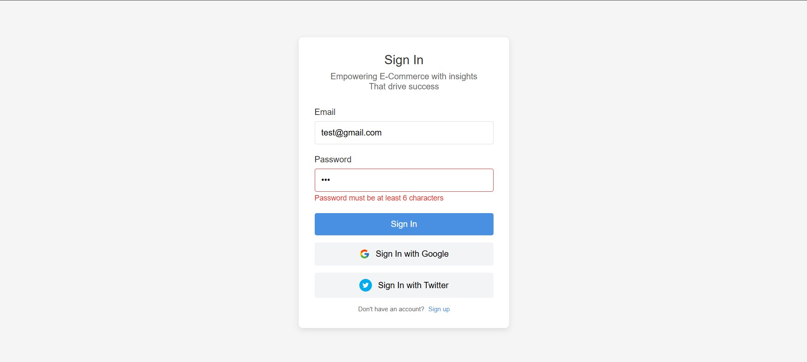
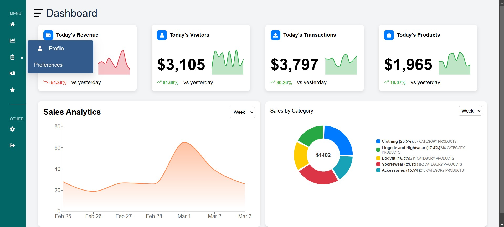
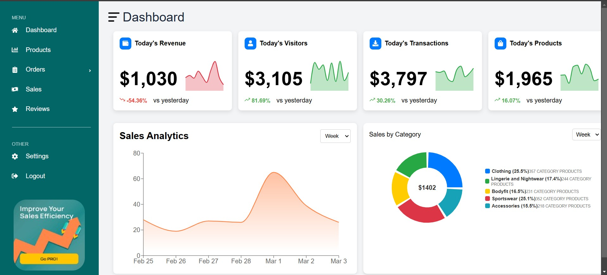
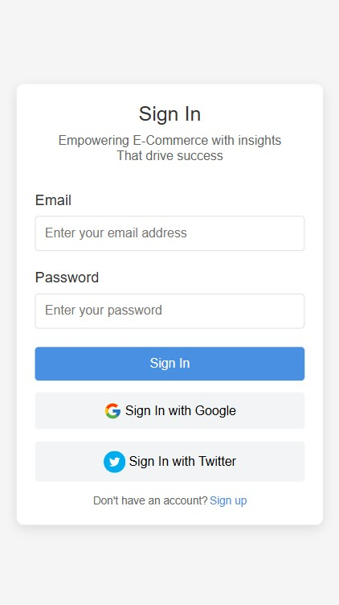
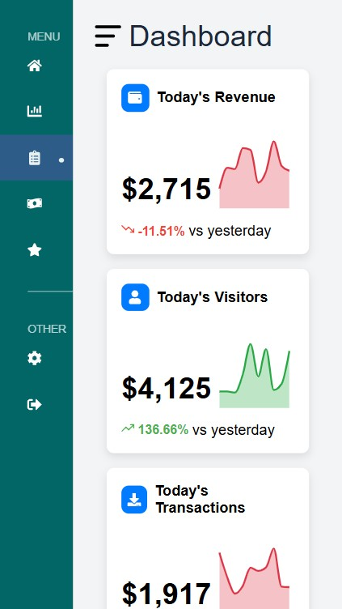
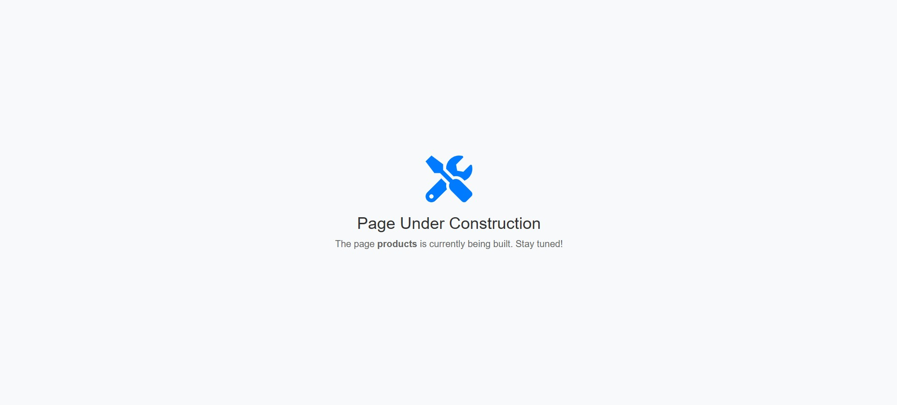
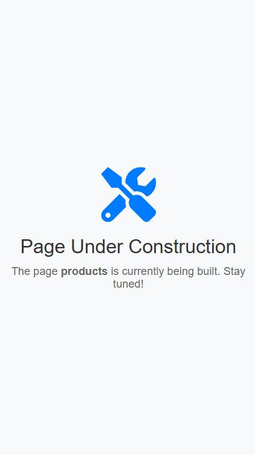

# Project Name

This is a **Next.js** project that runs on **Node.js version 23**.

## Screenshots

### **Desktop View**
#### Login Page


#### Dashboard (Collapsed Sidebar)


#### Dashboard (Non-Collapsed Sidebar)


### **Mobile View**
#### Login Page


#### Dashboard (Collapsed Sidebar)


### **Pages Under Construction**
#### Desktop View


#### Mobile View


## How to Run This Project

### **1. Clone the Repository**
```bash
git clone <repository-url>
cd <repository-folder>
```

### **2. Install Dependencies**
```bash
npm install
```

### **3. Run the Project**
```bash
npm run dev
```

The project will be available at: [http://localhost:3000](http://localhost:3000)

## **Login Credentials**
- **Email:** `test@gmail.com`
- **Password:** `password123`

Use these credentials to log in and explore the dashboard.

